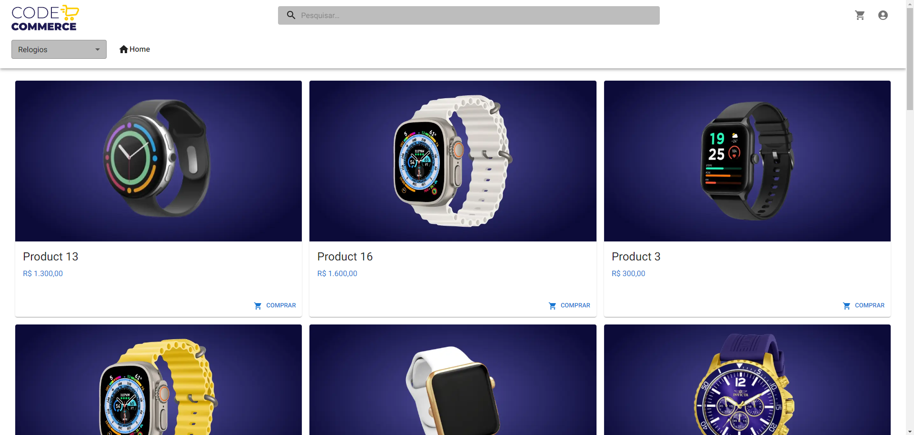

# **Imersão 17 FullCycle - Desenvolvimento de aplicações modernas e escaláveis com microsserviços**

<!--  -->

Projeto construído durante Imersão Full Stack & Full Cycle do Wesley Willians com o objetivo de Desenvolver uma aplicação moderna e escalável com microsserviços, contendo pedidos e forma de pagamento.

[🔗 Clique aqui para acessar](https://my-resume-bamarcheti.vercel.app/)

## **🛠 Tecnologias**

> ### _Banco de Dados_
>
> 
>
> ### _Server_
>
> 
> 
>
> ### _Frontend_
>
> 
> 
> 
>
> ### _Bibliotecas e Ferramentas_
>
> 
> 
> 
> 

## **✨ Como executar**

- **_[Go](./goApi/README.md)_**

## **💛 Contato**

